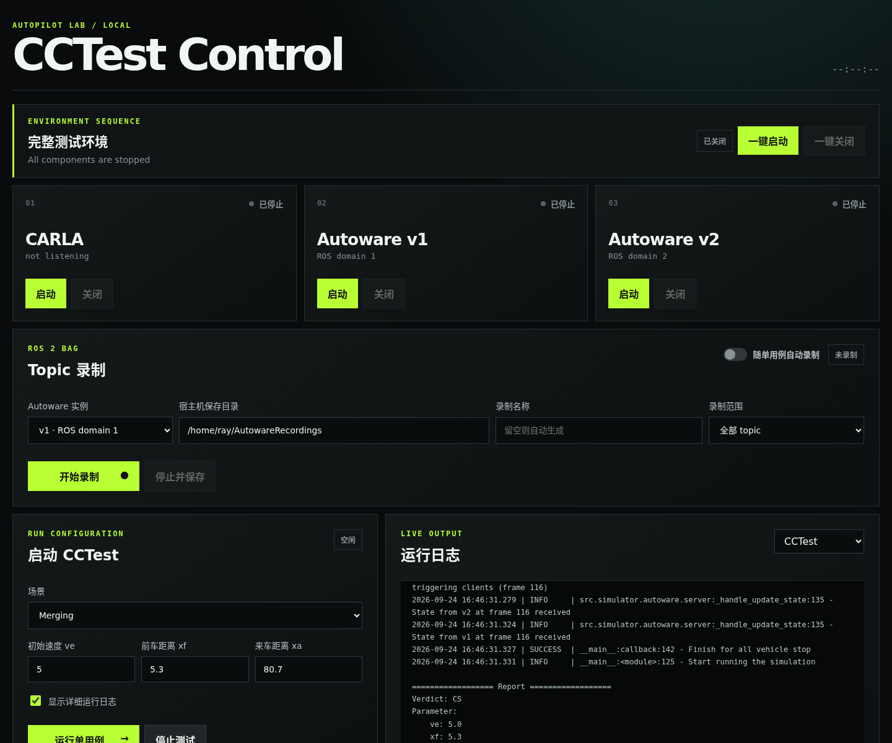

# Autoware Control Panel

A local web dashboard for controlling the Autoware CCTest environment. The
control panel is isolated from the CCTest source tree and Bazel targets and
does not add web dependencies to the test framework.



## Features

- Start and stop CARLA, Autoware v1, and Autoware v2 independently.
- Start the complete environment in order: CARLA, v1, then v2.
- Stop tests and recordings, then shut down v2, v1, and CARLA in reverse order.
- Run a configured single CCTest case and follow its live output.
- Stop the CCTest process automatically when its report is produced.
- Record all ROS 2 topics or a selected topic set from v1 or v2.
- Optionally start recording with a test and finalize the bag when the report
  appears. The default recording target is the v1 ego vehicle.
- Save completed rosbag directories to a custom location under the current
  user's home directory.

## Prerequisites

- Docker with NVIDIA Container Toolkit support.
- A working CARLA 0.9.14 installation.
- The local `autoware-v1-determinism:local` image.
- [`uv`](https://docs.astral.sh/uv/). The launcher uses an isolated Python 3.8
  runtime and does not modify the CCTest Python environment.
- CCTest Bazel targets built successfully.

## Start the dashboard

Run the launcher from the repository root:

```bash
bash tools/autoware-control-panel/run.sh
```

The server prints its local URL:

```text
CCTest Control Panel: http://127.0.0.1:8787
```

Open <http://127.0.0.1:8787> in a browser. The server listens on localhost only
and exposes a fixed set of control operations instead of an arbitrary shell.

If CARLA is installed somewhere other than the default
`/home/ray/Desktop/project/Carla` directory, set `CARLA_ROOT` before launching:

```bash
CARLA_ROOT=/absolute/path/to/Carla \
  bash tools/autoware-control-panel/run.sh
```

To use a different dashboard port:

```bash
bash tools/autoware-control-panel/run.sh --port 8788
```

Stop the dashboard itself with `Ctrl+C`. This does not automatically start the
simulation environment. Any active dashboard-managed rosbag recording is
finalized during a graceful dashboard shutdown.

## Typical workflow

1. Click **Start All** and wait until the environment status is ready.
2. Configure the test scenario and parameters.
3. Enable **Record with single test** when a rosbag is required.
4. Keep v1 selected for ego fault localization, or switch to v2 when the
   arriving vehicle must be investigated.
5. Choose all topics or load and select a smaller topic set.
6. Set the host output directory and optionally provide a recording name.
7. Run the single test case.
8. When the CCTest report appears, the test process and linked recording stop
   automatically and the completed bag is moved to the selected directory.

Manual recording remains available through **Start Recording** and
**Stop and Save**, independently of CCTest.

## Recording storage

The default output directory is:

```text
/home/ray/AutowareRecordings
```

While recording, bag data is staged through the existing `autoware_data`
container mount. After a clean recorder shutdown, the complete rosbag directory
is moved to the selected host location. Custom destinations are deliberately
restricted to the current user's home directory.

## Project layout

```text
tools/autoware-control-panel/
├── README.md
├── docs/
│   └── control-panel.png
├── run.sh
├── server.py
└── static/
    ├── app.js
    ├── index.html
    └── styles.css
```

Runtime logs are written to `tools/autoware-control-panel/runtime/`, which is
excluded from Git.
